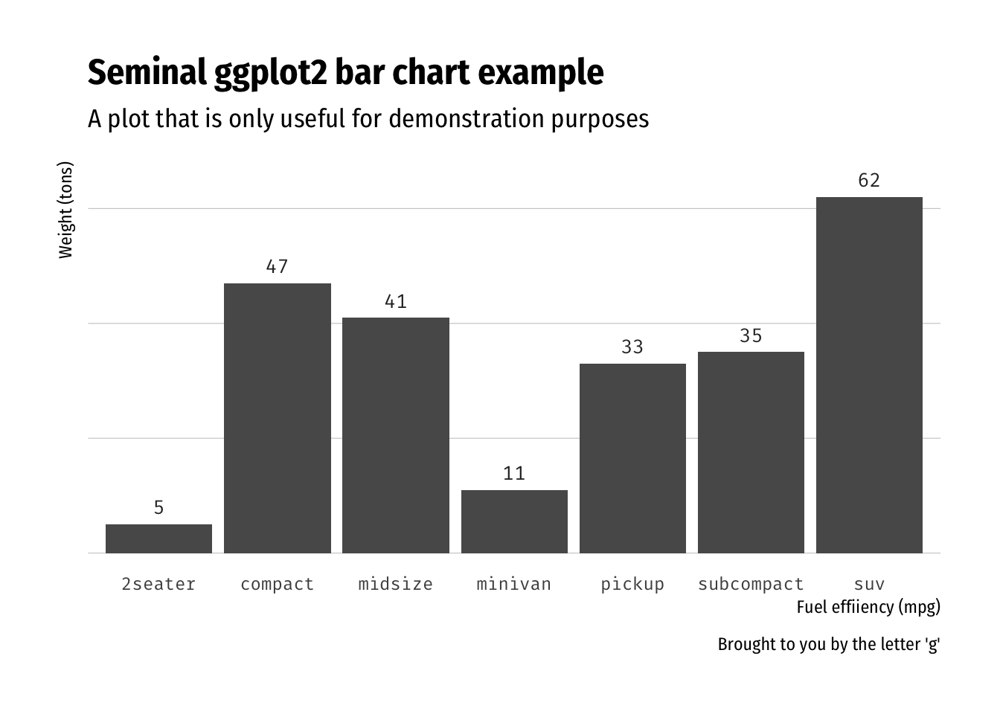

# firasans

Fira Sans Condensed + Fira Mono Font Theme Based on hrbrthemes

## Description

Fira Sans Condensed + Fira Mono Font Theme Based on hrbrthemes

## What’s Inside The Tin

The following functions are implemented:

  - `font_fsc`: Fira Sans Condensed font name R variable aliases
  - `font_fsm`: Fira Sans Condensed font name R variable aliases
  - `import_fira_sans`: Import Fira Sans/Mono fonts for use in charts
  - `theme_ipsum_fsc`: A precise & pristine ggplot2 theme with
    opinionated defaults and an emphasis on typography

## Installation

``` r
devtools::install_github("hrbrmstr/firasans")
```

## Usage

``` r
library(firasans)

# current verison
packageVersion("firasans")
```

    ## [1] '0.1.0'

### Theme Examples

``` r
library(ggplot2)
library(dplyr)

# seminal scatterplot
ggplot(mtcars, aes(mpg, wt)) +
  geom_point() +
  labs(x="Fuel effiiency (mpg)", y="Weight (tons)",
       title="Seminal ggplot2 scatterplot example",
       subtitle="A plot that is only useful for demonstration purposes",
       caption="Brought to you by the letter 'g'") +
  theme_ipsum_fsc()
```


``` r
# seminal bar chart
hrbrthemes::update_geom_font_defaults(family=font_fsm)

count(mpg, class) %>%
  ggplot(aes(class, n)) +
  geom_col() +
  geom_text(aes(label=n), nudge_y=3) +
  labs(x="Fuel effiiency (mpg)", y="Weight (tons)",
       title="Seminal ggplot2 bar chart example",
       subtitle="A plot that is only useful for demonstration purposes",
       caption="Brought to you by the letter 'g'") +
  theme_ipsum_fsc(grid="Y") +
  theme(axis.text.y=element_blank())
```


